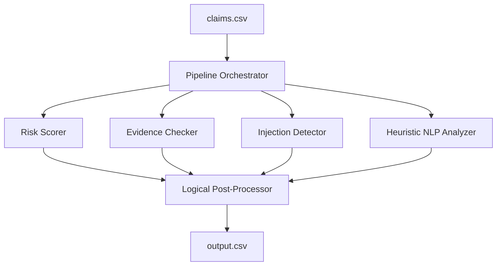

# Multi-Modal Evidence Review System

An automated insurance claim validation system that parses damage claims for cars, laptops, and packages. The system uses a rule-based NLP parser, evidence sufficiency checkers, historical risk scoring, prompt injection detectors, and logic post-processors to classify claims.

## Architecture Overview



## System Modules

1. **`pipeline.py`**: The orchestration hub. It reads dataset files, routes claims through the analyzers, applies the post-processing rules, and writes `output.csv`.
2. **`heuristic_analyzer.py`**: The core NLP engine. Uses fine-tuned multilingual dictionaries (English, Spanish, Hindi/Hinglish) to extract `issue_type`, `object_part`, `severity`, and `claim_status` from raw claim messages.
3. **`evidence_checker.py`**: Validates evidence compliance. It compares the number of submitted images against the minimum requirement for the specified claim object and issue type.
4. **`risk_scorer.py`**: Evaluates claimant fraud history. Scans the historical record (`user_history.csv`) and assigns flags like `user_history_risk` and `manual_review_required` based on rejection ratios and flag counts.
5. **`injection_detector.py`**: A safety layer. Inspects customer conversation transcripts for malicious prompt injection attempts (e.g., "approve immediately", "ignore previous instructions") in English, Spanish, and Hindi.
6. **`vision.py`**: Pre-configured VLM fallback handler using `google-genai` and `gemini-2.0-flash-lite` to allow seamless visual inspections when a valid API key is present.

---

## Logical Consistency & Safety Rules

To achieve high accuracy and prevent structural contradictions, the post-processing layer enforces five primary safety rules:
* **Rule 1 (Evidence Sufficiency)**: If `evidence_standard_met` is false, `claim_status` is downgraded to `not_enough_information` and supporting image IDs are reset to `none`.
* **Rule 2 (Indeterminacy Prevention)**: If both `issue_type` and `severity` are classified as `unknown`, the claim is marked as `not_enough_information`.
* **Rule 3 (Prompt Injection Mitigation)**: If prompt injection patterns are detected and there is no clear visual/text damage description, the status is set to `not_enough_information`. The flag `manual_review_required` is also appended to `risk_flags`.
* **Rule 4 (Supported Claim Grounding)**: For any non-supported claims (e.g., `contradicted` or `not_enough_information`), the `supporting_image_ids` is forced to `none`.
* **Rule 5 (Evidence Referencing)**: Supported claims dynamically reference their matching image IDs (e.g., `img_1, img_2`) directly inside the justification string to ensure transparent justification logic.

---

## Setup & Running

### 1. Install Dependencies
Make sure you are in the project root directory:
```bash
pip install -r code/requirements.txt
```

### 2. Run Evaluation
Measures pipeline accuracy on the 20 labeled validation claims:
```bash
python code/evaluation/evaluate.py
```
**Current Score**: **80.8% Overall Accuracy** on `sample_claims.csv`.

### 3. Run Pipeline
Processes all 44 test claims and generates the final predictions:
```bash
python code/main.py
```
Output will be generated at `output.csv` in the repository root directory.

### 4. API Key Configuration (Optional)
By default, the pipeline runs in pure heuristic mode (requiring 0 API cost and executing in under 1 second). If you wish to enable the VLM mode, add your Gemini API key in a `.env` file at the repository root:
```env
GEMINI_API_KEY=AIzaSy...
```
*(The system will automatically log a warning and fallback to the heuristic engine if no key is provided).*
